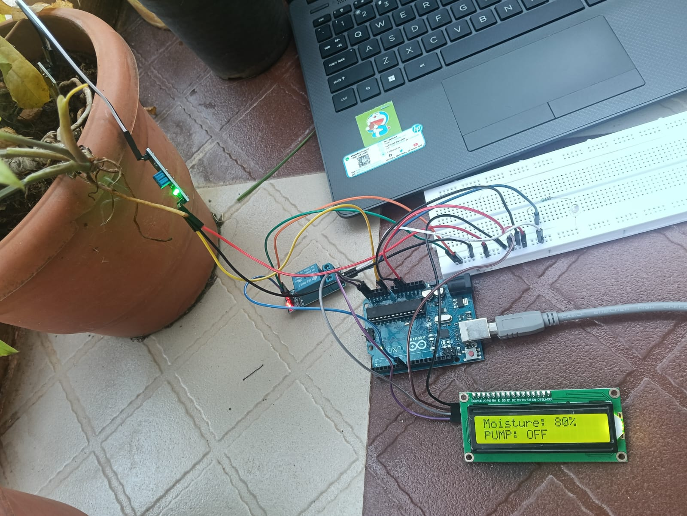
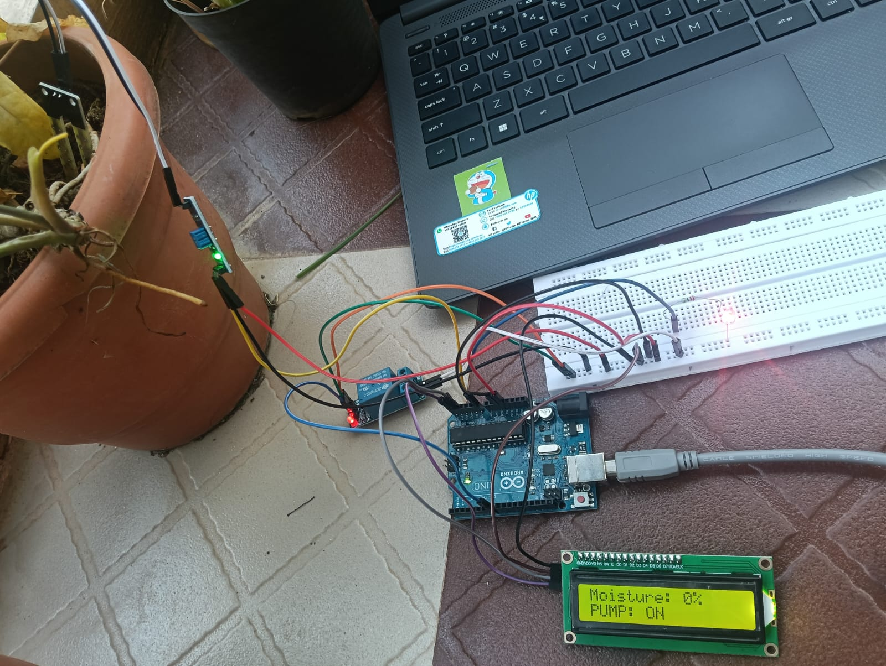

# Smart Irrigation System Using Arduino 🌱💧

An Arduino-based Smart Irrigation System that automatically monitors soil moisture and controls a water pump based on the moisture level of the soil. The system helps automate irrigation and reduces unnecessary water usage by supplying water only when the soil becomes sufficiently dry.

## 📌 Project Overview

Traditional irrigation systems often require manual monitoring and operation of water pumps. This project demonstrates a simple automated irrigation solution using an Arduino, soil moisture sensor, and relay-controlled water pump.

The soil moisture sensor continuously monitors the condition of the soil. Based on the sensor reading, the Arduino decides whether irrigation is required and switches the water pump ON or OFF through a relay module.

### Main Features

- 🌱 Automatic soil moisture monitoring
- 💧 Automatic water pump control
- 🔌 Relay-based switching
- ⚡ Arduino-based control system
- 🔄 Continuous real-time monitoring
- 💦 Helps reduce unnecessary water usage
- 🛠️ Simple and low-cost implementation

---

## 🎯 Objectives

- Monitor soil moisture continuously.
- Automatically determine whether irrigation is required.
- Control a water pump using a relay module.
- Reduce unnecessary water usage.
- Implement an automatic irrigation system using Arduino.
- Gain practical experience in sensor interfacing and relay control.

---
## 📸 Project Images

### Pump OFF Condition

When the soil moisture is sufficient, the relay remains OFF and the water pump is not activated.



---

### Pump ON Condition

When the soil becomes dry and the moisture level crosses the defined threshold, the relay activates the pump automatically.



---

## 🎥 Project Demonstration

A complete working demonstration of the Smart Irrigation System is included in this repository.

### Demo Video

📹 **demo-video.mp4**

The video demonstrates:

- Soil moisture monitoring
- Automatic pump activation
- Automatic pump deactivation
- Relay operation
- Real-time irrigation control

---

## 🧩 Components Used

| Component | Quantity | Purpose |
|-----------|----------|---------|
| Arduino Uno | 1 | Main controller |
| Soil Moisture Sensor | 1 | Measures soil moisture |
| Relay Module | 1 | Controls the water pump |
| Water Pump | 1 | Supplies water to the plant |
| Jumper Wires | As required | Electrical connections |
| Power Supply | 1 | Powers the system |

---

## ⚙️ Working Principle

The system operates by continuously monitoring the moisture level of the soil.

### Working Process

1. The soil moisture sensor detects the moisture level of the soil.
2. The sensor sends a corresponding signal to the Arduino.
3. Arduino compares the sensor reading with a predefined threshold.
4. If the soil is dry, Arduino activates the relay.
5. The relay switches the water pump ON.
6. Water is supplied to the soil.
7. When the soil reaches the required moisture level, Arduino deactivates the relay.
8. The water pump turns OFF.
9. The process continues automatically.

### System Flow

```text
Soil Moisture Sensor
        ↓
      Arduino
        ↓
  Moisture Threshold
        ↓
   ┌────┴────┐
   ↓         ↓
  Dry       Wet
   ↓         ↓
Relay ON   Relay OFF
   ↓         ↓
Pump ON    Pump OFF
   ↓
Irrigation
```

## 👩‍💻 Author

**Sanjana N**
Electronics and Communication Engineering  

